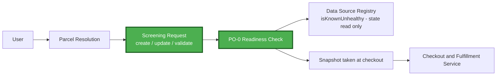
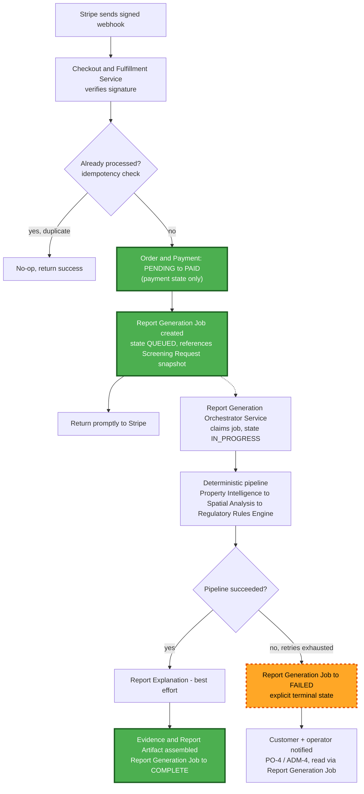
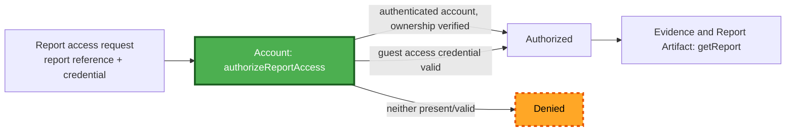

# Permit Preflight — Component Dependencies

**Revised 2026-08-19** — corrected the pre-payment/post-payment contradiction and updated all
diagrams for the 3 new components (Screening Request, Report Generation Job, Regulatory Source
Access) and the corrected ownership boundaries (Property Intelligence no longer classifies;
Order & Payment scoped to payment state only; report access gated through Account).

## Dependency Matrix

| Service / Component | Depends on |
|---|---|
| Project Preflight Service | Parcel Resolution, Screening Request, Data Source Registry (`isKnownUnhealthy` only — no live retrieval) |
| Vacant-Land Screening Service | Parcel Resolution, Screening Request, Data Source Registry (`isKnownUnhealthy` only) |
| Checkout & Fulfillment Service | Screening Request (reads validated snapshot), Order & Payment, Report Generation Job (creates) |
| Report Generation Orchestrator Service | Report Generation Job (claims/transitions), Screening Request (reads snapshot), Property Intelligence, Spatial Analysis, Regulatory Rules Engine, Report Explanation, Evidence & Report Artifact |
| Rule Governance Workflow Service | Regulatory Source Access, Rule Research Assistant, Regulatory Rule Governance; publishes to Regulatory Rules Engine's consumption boundary |
| Admin/Support Service | Evidence & Report Artifact, Regulatory Rule Governance, Data Source Registry, Order & Payment, Report Generation Job, Account, Support Case (owns) |
| Screening Request | Parcel Resolution (reads confirmed parcel reference only) |
| Property Intelligence | Data Source Registry |
| Regulatory Rules Engine | Spatial Analysis, Property Intelligence (evidence-quality states as input), Regulatory Rule Governance (read-only: ACTIVE rules) |
| Rule Research Assistant | Regulatory Source Access (evidence bundle), AI Service / AI Provider Adapter |
| Report Explanation | AI Service / AI Provider Adapter |
| Report Generation Job | Screening Request (references snapshot), Evidence & Report Artifact (references completed artifact) |
| Account | Evidence & Report Artifact (`getReport`, gated behind `authorizeReportAccess`) |

**Key asymmetries preserved/added**:
- Regulatory Rules Engine depends on Regulatory Rule Governance *read-only*, never the reverse (unchanged).
- **Property Intelligence never depends on, or is depended on by, Regulatory Rules Engine's classification logic** — it supplies evidence-quality states; the Engine alone decides KNOWN/INFERRED/REQUIRES VERIFICATION (corrected 2026-08-19).
- **Order & Payment and Report Generation Job have no dependency on each other** — Checkout & Fulfillment Service is the only component that touches both, and only to create a job after a payment-state transition, never to read/write the other's state directly (corrected 2026-08-19).
- **No service other than Report Generation Orchestrator Service depends on Spatial Analysis or Regulatory Rules Engine** — Project Preflight Service and Vacant-Land Screening Service depend only on Parcel Resolution and Screening Request pre-payment (corrected 2026-08-19).
- **Rule Research Assistant depends on Regulatory Source Access, not on the AI Service alone**, for source material (corrected 2026-08-19).
- **Evidence & Report Artifact's `getReport` is never called by a user-facing path without first passing Account's `authorizeReportAccess`** (added 2026-08-19).

## Communication Patterns

- **Services → Components**: synchronous in-process calls (modular monolith, no network hop).
- **Checkout & Fulfillment Service → Report Generation Job → Report Generation Orchestrator Service**: asynchronous. The job is created and persisted; the orchestrator claims it out-of-band. The webhook handler's synchronous work ends at "job created."
- **Report Generation Orchestrator Service ↔ Report Explanation**: synchronous call within the async job's execution, with graceful-degradation handling.
- **Rule Governance Workflow Service → Regulatory Source Access → Rule Research Assistant → Regulatory Rule Governance → Regulatory Rules Engine**: source acquisition, then AI synthesis, then human-gated lifecycle, then one-way publication at ACTIVE.

## Data Flow: Pre-Payment (Corrected 2026-08-19)



### Text Alternative
```
User -> Parcel Resolution -> Screening Request (create/update/validate)
Screening Request -> PO-0 Readiness Check
  PO-0 Readiness Check -> Data Source Registry (isKnownUnhealthy: cheap existing-state read only,
    NOT a live source retrieval, and NOT Spatial Analysis / Regulatory Rules Engine)
Screening Request -> Snapshot taken at checkout -> Checkout & Fulfillment Service

Nothing in this pre-payment flow invokes Spatial Analysis, Regulatory Rules Engine, Property
Intelligence, Report Explanation, or Evidence & Report Artifact. This corrects the prior version
of this document, which contradicted the PO-0 scoping.
```

## Data Flow: Post-Payment — Deterministic Evaluation → LLM Explanation Boundary

```mermaid
flowchart LR
    JOB["Report Generation Job<br/>claimed, IN_PROGRESS"] --> SNAP["Screening Request snapshot"]
    SNAP --> PI["Property Intelligence<br/>facts + evidence-quality states"]
    PI --> SA["Spatial Analysis"]
    SA --> RE["Regulatory Rules Engine<br/>owns classification decision"]
    RE --> FIND["Classified Findings<br/>KNOWN / INFERRED / REQUIRES VERIFICATION"]
    FIND -.->|deterministic boundary - findings are final here| RX["Report Explanation<br/>LLM - explains only"]
    RX --> NARR["Plain-language narrative<br/>tied to evidence IDs"]
    FIND --> ART["Evidence and Report Artifact"]
    NARR --> ART
    ART --> JOBDONE["Report Generation Job -> COMPLETE"]

    style RE fill:#4CAF50,stroke:#1B5E20,stroke-width:3px,color:#fff
    style FIND fill:#4CAF50,stroke:#1B5E20,stroke-width:3px,color:#fff
    style RX fill:#FFA726,stroke:#E65100,stroke-width:3px,stroke-dasharray: 5 5,color:#000
    style ART fill:#BBDEFB,stroke:#1565C0,stroke-width:2px,color:#000
```



### Text Alternative
```
Report Generation Job (claimed, IN_PROGRESS) -> reads Screening Request snapshot
  -> Property Intelligence (produces facts + evidence-quality states - NOT classifications)
  -> Spatial Analysis (produces geometric results)
  -> Regulatory Rules Engine (consumes both; OWNS the classification decision)
  -> Classified Findings (KNOWN / INFERRED / REQUIRES VERIFICATION) -- FINAL at this point

  Classified Findings -> Report Explanation (LLM, explains only, cannot change findings)
    -> Plain-language narrative (tied to evidence IDs)

  Classified Findings -----------------------------\
  Plain-language narrative (if available) ----------> Evidence & Report Artifact
                                                        -> Report Generation Job -> COMPLETE

If Report Explanation is unavailable or fails schema validation, Evidence & Report Artifact still
assembles from Classified Findings alone (graceful degradation, RGD-5).
```

## Data Flow: Payment → Job Creation → Async Generation (Corrected 2026-08-19)



### Text Alternative
```
1. Stripe sends signed webhook
2. Checkout & Fulfillment Service verifies signature
3. Idempotency check: if already processed, no-op and return success
4. Order & Payment: PENDING -> PAID (payment state ONLY - Report Generation Job is separate)
5. Report Generation Job created, state QUEUED, references the Screening Request snapshot
6. Service returns promptly to Stripe (webhook handling ends here)
--- asynchronous, out of band ---
7. Report Generation Orchestrator Service claims the job, state IN_PROGRESS
8. Deterministic pipeline: Property Intelligence -> Spatial Analysis -> Regulatory Rules Engine
9. Success: Report Explanation runs best-effort, then Evidence & Report Artifact assembles the
   immutable report; Report Generation Job -> COMPLETE (references the artifact)
10. Failure after retries exhausted: Report Generation Job -> FAILED (explicit terminal state)
11. Customer and operator notified (PO-4 / ADM-4) - operator view reads Report Generation Job,
    not Order & Payment, for generation status; reads Order & Payment for payment status. The two
    never share a state machine, so they cannot silently drift apart (single owner each).
```

## Data Flow: Report Access Authorization (added 2026-08-19)



### Text Alternative
```
Report access request (report reference + credential) -> Account.authorizeReportAccess
  -> if authenticated account with verified ownership: Authorized
  -> if valid guest access credential (secure emailed-link token): Authorized
  -> otherwise (including a bare client-supplied report ID with no credential): Denied

Only after Authorized does the caller proceed to Evidence & Report Artifact.getReport. No
user-facing path calls getReport directly.
```
