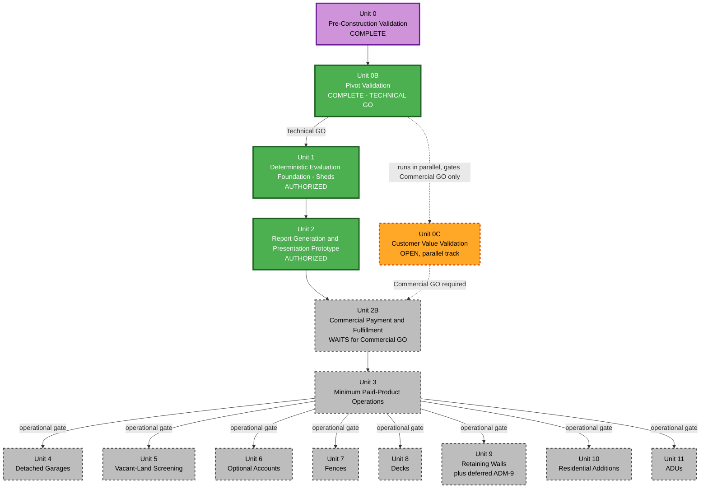

# Permit Preflight — Unit of Work Dependencies

**Revised 2026-08-19 (latest)** — Two-gate model adopted (see execution-plan.md TWO-GATE MODEL
section). Unit 2 split into Unit 2 (Report Generation & Presentation Prototype — Technical GO only)
and Unit 2B (Commercial Payment & Fulfillment — Commercial GO required). Technical GO is satisfied;
Commercial GO (Unit 0C) remains open. Units 3-11 now depend on Unit 2B specifically (not Unit 2)
plus Commercial GO, since they need real payment/orders/broader commercial surface to exist first.

**Revised 2026-08-19 (earlier)** per user review: sequence corrected (Vacant-Land at position 5,
before Optional Accounts at position 6); Unit 3 re-scoped.

## The Dependency Model

**Technical track** (authorized now): Unit 0 → Unit 0B → Technical GO → Unit 1 → Unit 2. This
chain requires no commercial validation — it proves the deterministic pipeline works and produces
real, generated (not hand-assembled) reports for Unit 0C to use.

**Commercial track** (gated behind Unit 0C): Unit 2B onward requires **both** Unit 2 (the technical
pipeline it wraps with payment) **and** Commercial GO (Unit 0C produces GO). Units 3 through 11
additionally require Unit 2B specifically (not just Unit 2) — they need real orders,
paying-customer surface area, or commercial account features to exist, none of which exist until
Commercial GO is reached and Unit 2B is built.

## Dependency Matrix

| Unit | Hard dependencies | Status (2026-08-19) |
|---|---|---|
| 0. Pre-Construction Validation | None | COMPLETE → PIVOT |
| 0B. Pivot Validation | Unit 0 PIVOT | COMPLETE → **TECHNICAL GO** (accepted) |
| 0C. Customer Value Validation | Runs in parallel with technical Construction | OPEN — gates Commercial GO only |
| 1. Deterministic Evaluation Foundation (Sheds) | Technical GO | **AUTHORIZED, proceeding** |
| 2. Report Generation & Presentation Prototype | Unit 1, Technical GO | **AUTHORIZED** |
| 2B. Commercial Payment & Fulfillment | Unit 2, **Commercial GO** | BLOCKED — awaiting Unit 0C |
| 3. Minimum Paid-Product Operations | Unit 2B, **Commercial GO** | BLOCKED |
| 4. Detached Garages | Unit 2B, Unit 3, **Commercial GO** | BLOCKED |
| 5. Vacant-Land Screening | Unit 2B, Unit 3, **Commercial GO** | BLOCKED |
| 6. Optional Accounts | Unit 2B, Unit 3, **Commercial GO** | BLOCKED |
| 7. Fences | Unit 2B, Unit 3, **Commercial GO** | BLOCKED |
| 8. Decks | Unit 2B, Unit 3, **Commercial GO** | BLOCKED |
| 9. Retaining Walls | Unit 2B, Unit 3, **Commercial GO** | BLOCKED |
| 10. Residential Additions | Unit 2B, Unit 3, **Commercial GO** | BLOCKED |
| 11. ADUs | Unit 2B, Unit 3, **Commercial GO** | BLOCKED |

**Explicit finding (unchanged from prior verification)**: no technical dependency exists among
Units 4, 5, 7, 8, 9, 10, 11 (the project-type units) or Unit 6 (Optional Accounts) — the approved
project-type sequence is preserved for product/architecture-proving reasons, not because the code
requires this exact order.

## What Proceeds Now vs. What Waits

**Proceeding immediately** (Technical GO): Unit 1 in full. Unit 2 (report generation/presentation
only — no live payment).

**Waiting on Unit 0C** (Commercial GO): Unit 2B (live Stripe payment), Unit 3 (paid-product
operations — nothing to operate on without Unit 2B), Units 4/5/7/8/9/10/11 (additional project
types), Unit 6 (Optional Accounts). None of this is "blocked pending Unit 0C" as a blanket
statement anymore — it is specifically the *commercial* surface that waits, while the technical
foundation (Units 1-2) proceeds in parallel with Unit 0C's interviews.

## Recommended Construction Order (Technical Track, Now)

```
Unit 0 (COMPLETE) -> Unit 0B (COMPLETE) -> TECHNICAL GO (accepted)
   |
   v
Unit 1 (Deterministic Evaluation Foundation - Sheds)  <-- IN PROGRESS
   |
   v
Unit 2 (Report Generation & Presentation Prototype)  <-- next
   |
   v
[HOLD for Commercial GO / Unit 0C]
   |
   v  [Commercial GO]
Unit 2B (Commercial Payment & Fulfillment)
   |
   v
Unit 3 (Minimum Paid-Product Operations)
   |
   v
Unit 4 -> Unit 5 -> Unit 6 -> Unit 7 -> Unit 8 -> Unit 9 -> Unit 10 -> Unit 11
```

## Dependency Diagram



### Text Alternative
```
Unit 0 (COMPLETE) -> Unit 0B (COMPLETE, produced TECHNICAL GO)
Unit 0B --[Technical GO]--> Unit 1 (AUTHORIZED, proceeding)
Unit 0B -.-> Unit 0C (runs in parallel; gates Commercial GO only, does not block Units 1-2)
Unit 1 --> Unit 2 (AUTHORIZED - report generation/presentation, no live payment)
Unit 2 --> Unit 2B (WAITS - requires Commercial GO from Unit 0C)
Unit 0C -.[Commercial GO required].-> Unit 2B
Unit 2B --> Unit 3 --[operational gate]--> Units 4,5,6,7,8,9,10,11 (all also require Commercial GO)

Green = complete or authorized-and-proceeding (Unit 0B, Unit 1, Unit 2). Purple = original
human-in-the-loop gate (Unit 0, historical). Orange dashed = Unit 0C, the open parallel commercial
gate. Gray dashed = everything waiting on Commercial GO (Unit 2B through Unit 11).
```

## PIVOT / NO-GO Handling (Commercial Track)

If Unit 0C produces **GO**: continue the commercial Construction sequence (Unit 2B onward) as
planned above. If **PIVOT**: revise the affected requirements/design/units while preserving the
Technical-GO-authorized work (Units 1-2 were specifically scoped to remain useful under plausible
product/report/pricing pivots). If **NO-GO**: stop further product-specific commercial investment;
assess which technical work (parcel resolution, spatial analysis, the rule-governance workflow
itself) remains reusable independent of this specific product.
