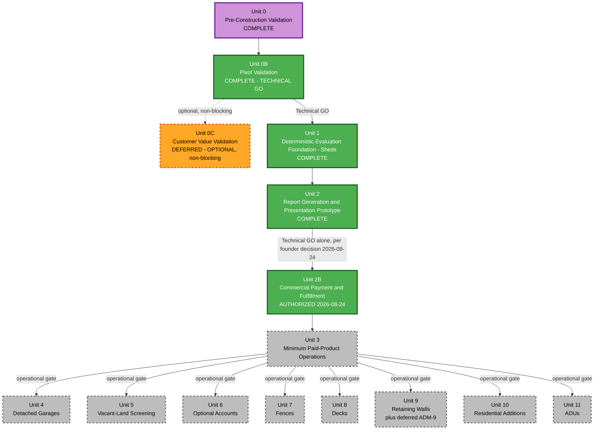

# Permit Preflight — Unit of Work Dependencies

**Founder decision, 2026-08-24 (supersedes Commercial GO as a blocker below)**: Commercial GO
(Unit 0C) is no longer a Construction dependency for Unit 2B or any later unit. Every "Commercial
GO" / "BLOCKED — awaiting Unit 0C" reference in this document reflects the *original* two-gate
model and is retained for historical accuracy, but Technical GO alone now authorizes Unit 2B
onward. Unit 3 remains its own separate, still-binding operational gate for Units 4-11 (unchanged).
See `aidlc-docs/aidlc-state.md`'s FOUNDER DECISION section for the full record. The matrix,
diagram, and construction order below are updated to reflect this; the two-gate history in the
"Revised 2026-08-19" note immediately below is preserved as originally written.

**Revised 2026-08-19 (latest)** — Two-gate model adopted (see execution-plan.md TWO-GATE MODEL
section). Unit 2 split into Unit 2 (Report Generation & Presentation Prototype — Technical GO only)
and Unit 2B (Commercial Payment & Fulfillment — Commercial GO required). Technical GO is satisfied;
Commercial GO (Unit 0C) remains open. Units 3-11 now depend on Unit 2B specifically (not Unit 2)
plus Commercial GO, since they need real payment/orders/broader commercial surface to exist first.

**Revised 2026-08-19 (earlier)** per user review: sequence corrected (Vacant-Land at position 5,
before Optional Accounts at position 6); Unit 3 re-scoped.

## The Dependency Model

**Technical track** (authorized): Unit 0 → Unit 0B → Technical GO → Unit 1 → Unit 2 → **Unit 2B**.
Technical GO alone now authorizes this entire chain through Unit 2B, per the founder decision
(2026-08-24) removing Commercial GO as a dependency. This chain requires no commercial validation.

**Operational track**: Unit 3 (Minimum Paid-Product Operations) depends on Unit 2B (needs real
orders to inspect/operate on) — this remains a genuine, unchanged dependency, just no longer
additionally conditioned on Commercial GO. Units 4-11 depend on Unit 3 (the operational gate,
unaffected by this decision).

**Commercial validation** (now optional, non-blocking): Unit 0C may still be pursued at the
founder's discretion, in parallel or later, but no unit's authorization depends on it any more.

## Dependency Matrix

| Unit | Hard dependencies | Status (2026-08-24) |
|---|---|---|
| 0. Pre-Construction Validation | None | COMPLETE → PIVOT |
| 0B. Pivot Validation | Unit 0 PIVOT | COMPLETE → **TECHNICAL GO** (accepted) |
| 0C. Customer Value Validation | None — optional, non-blocking | **DEFERRED — OPTIONAL COMMERCIAL VALIDATION** (founder decision, 2026-08-24; no interviews conducted, materials preserved) |
| 1. Deterministic Evaluation Foundation (Sheds) | Technical GO | **COMPLETE** |
| 2. Report Generation & Presentation Prototype | Unit 1, Technical GO | **COMPLETE** |
| 2B. Commercial Payment & Fulfillment | Unit 2, Technical GO | **AUTHORIZED 2026-08-24** — starting Functional Design |
| 3. Minimum Paid-Product Operations | Unit 2B | BLOCKED (operational gate, awaiting Unit 2B) |
| 4. Detached Garages | Unit 2B, Unit 3 | BLOCKED |
| 5. Vacant-Land Screening | Unit 2B, Unit 3 | BLOCKED |
| 6. Optional Accounts | Unit 2B, Unit 3 | BLOCKED |
| 7. Fences | Unit 2B, Unit 3 | BLOCKED |
| 8. Decks | Unit 2B, Unit 3 | BLOCKED |
| 9. Retaining Walls | Unit 2B, Unit 3 | BLOCKED |
| 10. Residential Additions | Unit 2B, Unit 3 | BLOCKED |
| 11. ADUs | Unit 2B, Unit 3 | BLOCKED |

**Explicit finding (unchanged from prior verification)**: no technical dependency exists among
Units 4, 5, 7, 8, 9, 10, 11 (the project-type units) or Unit 6 (Optional Accounts) — the approved
project-type sequence is preserved for product/architecture-proving reasons, not because the code
requires this exact order.

## What Proceeds Now vs. What Waits

**Complete**: Unit 1, Unit 2 (both formally closed, not to be reopened for ordinary refinement).

**Proceeding now**: Unit 2B (Commercial Payment & Fulfillment) — authorized on Technical GO alone,
per the founder decision (2026-08-24) removing Commercial GO as a dependency.

**Still waiting**: Unit 3 (needs real orders from Unit 2B to operate on — an unchanged, genuine
dependency), and Units 4-11 (wait on Unit 3's operational gate). None of this waits on Unit 0C any
longer.

## Recommended Construction Order (Current)

```
Unit 0 (COMPLETE) -> Unit 0B (COMPLETE) -> TECHNICAL GO (accepted)
   |
   v
Unit 1 (Deterministic Evaluation Foundation - Sheds)  <-- COMPLETE
   |
   v
Unit 2 (Report Generation & Presentation Prototype)  <-- COMPLETE
   |
   v
Unit 2B (Commercial Payment & Fulfillment)  <-- IN PROGRESS (authorized 2026-08-24, no longer waits
   |                                             on Commercial GO / Unit 0C)
   v
Unit 3 (Minimum Paid-Product Operations)  <-- operational gate, still binding
   |
   v
Unit 4 -> Unit 5 -> Unit 6 -> Unit 7 -> Unit 8 -> Unit 9 -> Unit 10 -> Unit 11
```

*(Unit 0C may still be conducted at any point, in parallel, at the founder's discretion — it no
longer sits on this critical path.)*

## Dependency Diagram



### Text Alternative
```
Unit 0 (COMPLETE) -> Unit 0B (COMPLETE, produced TECHNICAL GO)
Unit 0B --[Technical GO]--> Unit 1 (COMPLETE)
Unit 0B -.-> Unit 0C (DEFERRED - optional, non-blocking, does not sit on this critical path)
Unit 1 --> Unit 2 (COMPLETE - report generation/presentation, no live payment)
Unit 2 --[Technical GO alone, founder decision 2026-08-24]--> Unit 2B (AUTHORIZED, IN PROGRESS)
Unit 2B --> Unit 3 --[operational gate]--> Units 4,5,6,7,8,9,10,11

Green = complete or authorized-and-proceeding (Unit 0B, Unit 1, Unit 2, Unit 2B). Purple = original
human-in-the-loop gate (Unit 0, historical). Orange dashed = Unit 0C, deferred/optional, no longer
gating anything. Gray dashed = everything still waiting on Unit 3's operational gate (Unit 3
through Unit 11).
```

## PIVOT / NO-GO Handling (Commercial Track)

**Superseded by founder decision, 2026-08-24**: this section originally made Unit 2B onward
conditional on a Unit 0C GO/PIVOT/NO-GO outcome. That gating no longer applies — Unit 2B is
authorized and proceeding regardless of Unit 0C. If Unit 0C is conducted later and produces a
PIVOT- or NO-GO-shaped finding (e.g. real evidence that willingness-to-pay is materially lower than
assumed, or that the report format doesn't serve the target persona), treat it as ordinary product
feedback to weigh against real usage data at that point — not as a retroactive stop-work order on
work already shipped. Historical framing preserved below for the record only.

*Original text*: If Unit 0C produces **GO**: continue the commercial Construction sequence (Unit 2B
onward) as planned above. If **PIVOT**: revise the affected requirements/design/units while
preserving the Technical-GO-authorized work (Units 1-2 were specifically scoped to remain useful
under plausible product/report/pricing pivots). If **NO-GO**: stop further product-specific
commercial investment; assess which technical work (parcel resolution, spatial analysis, the
rule-governance workflow itself) remains reusable independent of this specific product.
