# Execution Plan — Permit Preflight

**Project type**: Greenfield. Sections below marked "Brownfield Only" in the standard template are
N/A and omitted/noted accordingly.

## Detailed Analysis Summary

### Change Impact Assessment
- **User-facing changes**: Yes — the entire product is new: existing-property and vacant-land screening workflows, checkout, optional accounts, web + PDF reports (stories.md Epics 1-6).
- **Structural changes**: Yes — new modular-monolith system (Next.js/TypeScript, PostgreSQL+PostGIS) per requirements.md §9.
- **Data model changes**: Yes — new normalized `PropertyContext` model, evidence/provenance model, regulatory rule model (with Tier 1/Tier 2 lifecycle), order/payment model, account model (requirements.md §3.3, §4.1, §9.1).
- **API changes**: Yes — all APIs are new (parcel resolution, evaluation, checkout/webhook, report retrieval, account, admin).
- **NFR impact**: Yes — Security Baseline and Resiliency Baseline extensions are both enabled (aidlc-state.md Extension Configuration); targeted Property-Based Testing is enabled.

### Risk Assessment
- **Risk Level**: **High** — driven by domain stakes (regulatory correctness, payment correctness, legal/financial exposure per requirements.md §6, §9, §13, legal-questions-for-counsel.md), not by rollback complexity (N/A for a new build). The two structural mitigations already designed into the approved requirements are the primary risk controls: (1) the deterministic-vs-LLM boundary (LLM never determines regulatory/spatial conclusions, requirements.md §5.1), and (2) the Tier 1/Tier 2 human-approval rule lifecycle (requirements.md §3.2) — both are carried forward as hard constraints into every subsequent stage, per the user's explicit standing instruction.
- **Testing Complexity**: Moderate-to-Complex — fixture-based regulatory scenarios plus targeted property-based tests for spatial/geometry primitives (requirements.md §8).
- **Solo-developer constraint**: Explicitly factored into phase/unit planning below (requirements.md §14) — this plan favors a small number of right-sized, mostly-sequential units over a large number of small, highly-parallelized ones, since there is no team to parallelize across.

## Workflow Visualization

```mermaid
flowchart TD
    Start(["Permit Preflight MVP"])

    subgraph INCEPTION["Inception Phase"]
        WD["Workspace Detection<br/><b>COMPLETED</b>"]
        RA["Requirements Analysis<br/><b>COMPLETED</b>"]
        US["User Stories<br/><b>COMPLETED</b>"]
        WP["Workflow Planning<br/><b>IN PROGRESS</b>"]
        AD["Application Design<br/><b>EXECUTE</b>"]
        UG["Units Generation<br/><b>EXECUTE</b>"]
    end

    subgraph CONSTRUCTION["Construction Phase, per Unit"]
        FD["Functional Design<br/><b>ASSESS PER UNIT</b>"]
        NFRA["NFR Requirements<br/><b>ASSESS PER UNIT</b>"]
        NFRD["NFR Design<br/><b>ASSESS PER UNIT</b>"]
        ID["Infrastructure Design<br/><b>ASSESS PER UNIT</b>"]
        CG["Code Generation<br/><b>EXECUTE</b>"]
        BT["Build and Test<br/><b>EXECUTE</b>"]
    end

    subgraph OPERATIONS["Operations Phase"]
        OPS["Operations<br/><b>PLACEHOLDER</b>"]
    end

    Start --> WD
    WD --> RA
    RA --> US
    US --> WP
    WP --> AD
    AD --> UG
    UG --> FD
    FD --> NFRA
    NFRA --> NFRD
    NFRD --> ID
    ID --> CG
    WP -.-> CG
    CG --> BT
    BT -.-> OPS
    BT --> End(["MVP Complete"])

    style WD fill:#4CAF50,stroke:#1B5E20,stroke-width:3px,color:#fff
    style RA fill:#4CAF50,stroke:#1B5E20,stroke-width:3px,color:#fff
    style US fill:#4CAF50,stroke:#1B5E20,stroke-width:3px,color:#fff
    style WP fill:#4CAF50,stroke:#1B5E20,stroke-width:3px,color:#fff
    style AD fill:#FFA726,stroke:#E65100,stroke-width:3px,stroke-dasharray: 5 5,color:#000
    style UG fill:#FFA726,stroke:#E65100,stroke-width:3px,stroke-dasharray: 5 5,color:#000
    style FD fill:#FFA726,stroke:#E65100,stroke-width:3px,stroke-dasharray: 5 5,color:#000
    style NFRA fill:#FFA726,stroke:#E65100,stroke-width:3px,stroke-dasharray: 5 5,color:#000
    style NFRD fill:#FFA726,stroke:#E65100,stroke-width:3px,stroke-dasharray: 5 5,color:#000
    style ID fill:#FFA726,stroke:#E65100,stroke-width:3px,stroke-dasharray: 5 5,color:#000
    style CG fill:#4CAF50,stroke:#1B5E20,stroke-width:3px,color:#fff
    style BT fill:#4CAF50,stroke:#1B5E20,stroke-width:3px,color:#fff
    style OPS fill:#BDBDBD,stroke:#424242,stroke-width:2px,stroke-dasharray: 5 5,color:#000
    style INCEPTION fill:#BBDEFB,stroke:#1565C0,stroke-width:3px,color:#000
    style CONSTRUCTION fill:#C8E6C9,stroke:#2E7D32,stroke-width:3px,color:#000
    style OPERATIONS fill:#FFF59D,stroke:#F57F17,stroke-width:3px,color:#000
    style Start fill:#CE93D8,stroke:#6A1B9A,stroke-width:3px,color:#000
    style End fill:#CE93D8,stroke:#6A1B9A,stroke-width:3px,color:#000

    linkStyle default stroke:#333,stroke-width:2px
```



### Text Alternative
```
INCEPTION PHASE
- Workspace Detection: COMPLETED
- Requirements Analysis: COMPLETED (approved)
- User Stories: COMPLETED (approved, 54 stories / 4 personas)
- Workflow Planning: IN PROGRESS (this document)
- Application Design: EXECUTE (next)
- Units Generation: EXECUTE (after Application Design)

CONSTRUCTION PHASE (per Unit of Work, once Units Generation defines units)
- Functional Design: assessed per unit
- NFR Requirements: assessed per unit (Security/Resiliency/PBT extensions enabled)
- NFR Design: assessed per unit
- Infrastructure Design: assessed per unit
- Code Generation: EXECUTE (always, per unit)
- Build and Test: EXECUTE (always, after all units)

OPERATIONS PHASE: placeholder, not started

Construction does not begin until the user explicitly approves at the Units Generation gate.
```

## Phases to Execute

### 🔵 INCEPTION PHASE
- [x] Workspace Detection (COMPLETED)
- [x] Reverse Engineering (N/A — greenfield)
- [x] Requirements Analysis (COMPLETED, approved)
- [x] User Stories (COMPLETED, approved)
- [x] Workflow Planning (this document)
- [ ] **Application Design — EXECUTE**
  - **Rationale**: Multiple new components/services need their methods, business rules, and dependencies defined before decomposition into units — e.g. the PropertyContext/property-intelligence service, the regulatory rules engine (with its Tier 1/Tier 2 governance workflow), the PostGIS spatial-analysis service, the AI service abstraction, the report-generation orchestrator, the payment/order service, and the account service. This is squarely the "new components or services needed, component methods and business rules need definition, service layer design required" trigger.
- [ ] **Units Generation — EXECUTE**
  - **Rationale**: New data models/schemas, new API surface, complex business logic (regulatory rules, spatial calculations), state management (order lifecycle, rule lifecycle), and new infrastructure all apply. Units of Work will be defined honoring the approved project-type sequence (requirements.md §1.4: sheds → garages → vacant-land → fences → decks → retaining walls → additions → ADUs) and will explicitly include the pre-construction validation (requirements.md §11) as an early, human-in-the-loop unit that gates substantial application Construction — not a step that can be silently skipped or merged into general engineering work.

### 🟢 CONSTRUCTION PHASE
*(Per-unit stages below are assessed individually for each Unit of Work once Units Generation defines them — not decided monolithically here, per the workflow's adaptive per-unit design. Expected pattern, to be confirmed per unit:)*
- [ ] Functional Design — **likely EXECUTE for most units** (complex business logic/data models are the norm in this domain, not the exception)
- [ ] NFR Requirements — **likely EXECUTE for most units** (Security Baseline and Resiliency Baseline extensions are enabled project-wide; most units touch payment, PII, or external APIs)
- [ ] NFR Design — **likely EXECUTE wherever NFR Requirements executes**
- [ ] Infrastructure Design — **EXECUTE for the foundational unit** (hosting/DB/PostGIS/deployment setup); **likely SKIP or lightweight for later units** that reuse already-established infrastructure
- [x] Code Generation — EXECUTE (ALWAYS, per unit)
- [x] Build and Test — EXECUTE (ALWAYS, after all units)

### 🟡 OPERATIONS PHASE
- [ ] Operations — PLACEHOLDER (future deployment/monitoring workflows)

## Standing Constraints Carried Forward Into Application Design & Units Generation

Per the user's explicit instruction when approving User Stories, these are not re-litigated at each
subsequent stage — they are binding inputs:
1. **Traceability**: every Application Design and Units Generation artifact must trace back to requirements.md and stories.md.
2. **Surface, don't silently resolve**: any material conflict discovered in Application Design or Units Generation is reported to the user, not quietly engineered around.
3. **Approved project-type sequence** (requirements.md §1.4) directly informs Unit of Work boundaries and dependencies — the two foundational project types (sheds, garages) establish shared architecture; vacant-land is unit-scoped early per its approved position; the sequence may only change if a genuine technical-dependency reason is surfaced and approved, never silently reordered.
4. **Solo-developer sizing**: units are sized for sequential, single-developer delivery, not team parallelism (requirements.md §14).
5. **Deterministic/LLM boundary**: every unit touching regulatory or spatial conclusions must keep the LLM strictly to explanation/synthesis (requirements.md §5.1, stories.md RGD-5/VL-5).
6. **Tier 1/Tier 2 rule lifecycle**: the Regulatory Rule Authoring & Governance epic (stories.md Epic 7) and its human-approval gates are preserved as-designed, not simplified away during Application Design.
7. **Pre-construction validation is a genuine gate**: it must be scoped as an early unit that can produce a real go/no-go finding (requirements.md §11) before substantial application Construction proceeds — not a formality. **Formalized 2026-08-19 (user clarification) as "Unit 0" — see the dedicated section below.**

## TWO-GATE MODEL (revised 2026-08-19, superseding the single-gate model below for authorization purposes — history preserved as-is)

Unit 0 (lightweight validation) → Unit 0B (pivot validation) together produced a **TECHNICAL
FEASIBILITY GATE**, now passed: multi-source parcel resolution evidenced (26 real test cases, the
false-confident-wrong-match failure mode caught twice under adversarial retest), ECA precedence
resolved with a concrete policy, regulatory source access confirmed workable as a curated offline
workflow (never a production-runtime dependency), and deterministic rule authoring demonstrated
feasible (though the Tier 2 review burden is real and quantified at ~80% of early rules, higher
than originally assumed). **TECHNICAL GO — accepted by the user 2026-08-19.**

A second, independent **COMMERCIAL VALUE GATE** (Unit 0C) remains open: whether real target-persona
users find the realistic report (including its REQUIRES VERIFICATION-heavy reality) valuable enough
to pay for. This requires real human interviews the AI cannot conduct or fabricate — see
`aidlc-docs/construction/unit-0-pre-construction-validation/unit-0c-customer-value-interview-protocol.md`.
This gate runs in **parallel** with technical Construction, not before it, and specifically gates
**substantial commercial expansion**, not all engineering work.

**What Technical GO authorizes**: Unit 1 (Deterministic Evaluation Foundation - Sheds) in full, and
a validation-useful subset of Unit 2 (see the revised Unit 2 definition in `unit-of-work.md` —
report generation/presentation, explicitly excluding live payment/commercial fulfillment). Low-regret
engineering that remains useful under plausible product/report/pricing pivots: Parcel Resolution,
Property Intelligence/PropertyContext, Data Source Registry, Spatial Analysis, Regulatory Source
Access, Rule Research Assistant, Regulatory Rule Governance, Rule Governance Workflow, Regulatory
Rules Engine, real shed rules and deterministic tests, evidence/provenance architecture, KNOWN/INFERRED/REQUIRES
VERIFICATION behavior, and report-artifact/presentation prototyping.

**What remains gated behind Commercial GO**: live Stripe payment/checkout integration and
fulfillment (Unit 2B, split out of the original Unit 2 — see `unit-of-work.md`), Minimum Paid-Product
Operations (Unit 3, since it has nothing real to operate on without live payment), broad expansion
across additional project types (Units 4, 5, 7-11), Optional Accounts sophistication (Unit 6),
substantial Tier 2 professional-review spending beyond proving the first (shed) deterministic rule
set, broad admin/support expansion, marketing/launch infrastructure, and production scaling work.

**If Unit 0C later produces**: **GO** → continue the approved commercial Construction sequence
(Unit 2B onward) as originally planned. **PIVOT** → revise the affected requirements/design/units
while preserving reusable technical work (the Technical-GO-authorized units are designed to remain
useful under plausible pivots, per the user's explicit instruction). **NO-GO** → stop further
product-specific investment; assess which technical work (parcel resolution, spatial analysis, the
regulatory rule-governance workflow itself) remains reusable independent of this specific product.

---

## FOUNDER DECISION — COMMERCIAL VALUE GATE NO LONGER BLOCKS CONSTRUCTION (2026-08-24)

**This amends the TWO-GATE MODEL above; it does not rewrite it.** The two-gate model's description
of what was decided on 2026-08-19, and why, is preserved as-is immediately above for the historical
record. This section records a subsequent, explicit founder decision that changes what the gate
*does* going forward.

**Decision**: Permit Preflight continues Construction without requiring Unit 0C customer interviews
first. Commercial validation is no longer a prerequisite for continuing Construction. Technical GO
remains valid and, on its own, now authorizes Unit 2B onward (Unit 3 remains its own separate,
still-binding operational gate for Units 4-11 — unaffected by this decision).

**Unit 0C status**: **DEFERRED — OPTIONAL COMMERCIAL VALIDATION**. Not COMPLETE, PASSED, FAILED,
GO, or NO-GO. No interviews have been conducted. The interview protocol was designed
(`unit-0c-customer-value-interview-protocol.md`) but the founder elected to continue building
before conducting it. Materials are preserved for possible later use, not discarded.

**What this does NOT do**: it does not convert any unvalidated commercial assumption into a
validated fact. Willingness to pay, the $9.99 (or any other) price point, repeat-professional
demand, market size/conversion assumptions, and direct paid-customer demand all remain
**UNVALIDATED / HYPOTHESIS**, exactly as before this decision.

**Operating model going forward**: BUILD → TEST → SHIP → OBSERVE → AMEND. Real product usage,
attempted purchases, completed purchases, abandonment, support feedback, and repeat usage may
become genuine commercial-validation evidence once the product reaches real users — a later,
different evidentiary source than Unit 0C interviews, not a substitute already in hand.

**Binding on future AI-DLC stages**: do not stop or refuse to proceed with Construction merely
because Unit 0C interviews have not occurred, willingness-to-pay has not been empirically
established, or a separate "Commercial GO" has not been declared. Do not reintroduce this gate by
citing the TWO-GATE MODEL section above as still-binding policy — it is superseded specifically on
the point of blocking Construction; its factual/historical content otherwise stands.

**Next unit**: Unit 2B — Commercial Payment & Fulfillment. See `aidlc-state.md`'s FOUNDER DECISION
section for the authoritative, single source of truth on this decision.

---

## [HISTORICAL] Unit 0 Gate & GO / PIVOT / NO-GO Decision Model (added 2026-08-19, user clarification)

**Sequence**: Inception (this plan) → Application Design → Units Generation → Inception approval gate → **Unit 0: Pre-Construction Validation** → explicit **GO / PIVOT / NO-GO** decision → only then substantial production Construction.

- **Unit 0 is lightweight and human-in-the-loop**, exactly as approved in requirements.md §11 (E3) — it must NOT require building the production application to perform. Scripts, spreadsheets, manual regulatory research, GIS tools, or API experiments are all acceptable tooling.
- **All production-oriented Units of Work depend, directly or indirectly, on a GO decision from Unit 0.** Units Generation must express this dependency explicitly in the unit dependency map — no production unit is sequenced or authorized to proceed independent of the Unit 0 outcome.
- **Decision outcomes**:
  - **GO** — authorizes progression into the approved production units as sequenced.
  - **NO-GO** — stops further production Construction. The finding is surfaced per Brief §58 (do not silently engineer around a fundamental problem).
  - **PIVOT** — returns the project to the appropriate requirements.md, application-design.md, and/or units-generation artifacts for revision before continuing; Construction does not proceed on the original plan unchanged.
- This decision model is a standing constraint on Units Generation (which must structure Unit 0 and its dependents accordingly) and does not change Application Design's own scope, except insofar as Application Design must remain revisable if Unit 0 produces a PIVOT (see the right-sizing note below).

## Application Design Scope Guidance (added 2026-08-19, user clarification)

Because Unit 0 can still invalidate or materially reshape the product, **Application Design should resolve core architectural invariants without over-investing in implementation decisions that can reasonably be deferred to per-unit Functional/NFR/Infrastructure Design after validation.** This is a right-sizing instruction, not a request to weaken Application Design — the following must still be resolved during Inception:
- The deterministic regulatory/spatial conclusions vs. LLM-explanation boundary
- PropertyContext and evidence/provenance concepts
- PostGIS as the spatial source of truth
- Rule versioning and Tier 1/Tier 2 governance
- Report immutability/reproducibility
- Payment authorization boundaries
- Security/trust boundaries
- Major service/component responsibilities
- Failure and source-health concepts

Everything below that level of resolution (e.g., exact method signatures, exact schema field lists, exact infrastructure provider selection) is fair game to defer to per-unit Construction-phase design, precisely because Unit 0 may still reshape those details.

## Estimated Timeline
- **Total Inception stages remaining**: 2 (Application Design, Units Generation) before the Inception approval gate.
- **Duration**: Not estimated in absolute time — no hard timeline constraint exists (requirements.md §14, E4); paced by solo-founder availability and, per requirements.md §3.2/§14, by regulatory-rule research/verification time once Construction begins.

## Success Criteria
- **Primary goal**: A validated, approved architecture and unit breakdown ready for Construction, with the pre-construction validation unit positioned to produce a genuine go/no-go signal before substantial build effort.
- **Key deliverables**: `application-design.md` (+ component/service definitions), `unit-of-work.md` (+ dependency map), both traceable to requirements.md/stories.md.
- **Quality gates**: User approval at Application Design completion; user approval at Units Generation completion; explicit user approval before Construction begins (unchanged standing instruction).
